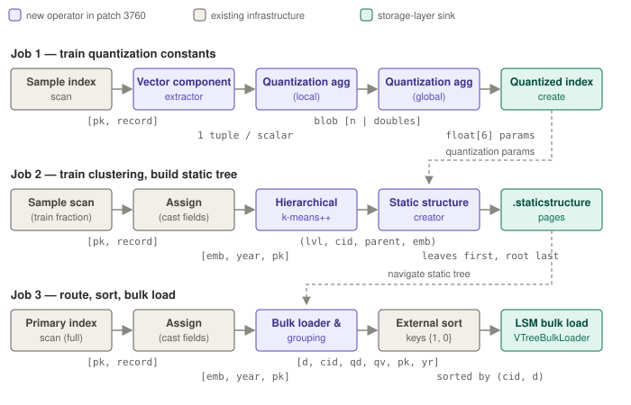

# End-to-end index creation dataflow

> **Status:** current
> **Verified against:** `e36bfa0681` + working tree (2026-07-03; includes `trainseed` knob and
> materializer leak fix, both post-3760)
> **Scope:** the complete dataflow of `CREATE INDEX ... TYPE VTREE`, hop by hop — every
> operator, every edge's tuple format, every artifact handed to the next stage.



## Orchestration: one statement, three Hyracks jobs

`QueryTranslator#doCreateIndexImpl` runs the jobs sequentially, committing a metadata
transaction between each. The index enters the catalog as `PENDING_ADD_OP` (invisible to
queries) and is re-added as `PENDING_NO_OP` only after Job 3 succeeds; any failure triggers
the drop-index cleanup path. Job specs are built by
`SecondaryVectorOperationsHelper` (asterix-metadata), selected for `IndexType.VTREE` by the
`SecondaryIndexOperationsHelper` factory. Precondition: the dataset must have a **sample
index** (`ANALYZE DATASET`) — Job 1 reads it.

```
Job 1 (buildCreationJobSpec)        → empty LSM files + quantization constants on resource
Job 2 (buildStaticStructureJobSpec) → trained centroid tree in .staticstructure
Job 3 (buildLoadingJobSpec)         → first disk component (data + directory + static pages)
```

## Job 1 — quantization training

```
sample index scan
  → VectorComponentExtractor            [1 single-ADouble tuple per vector component]
  → QuantizationConstantsAggregate(local)   [BINARY blob: [count:int][raw doubles...]]
  → QuantizationConstantsAggregate(global)  [float[6]: minQ, maxQ, alpha, CI, bits, n]
  → QuantizedIndexCreate                → LSMVTreeLocalResource JSON
```

- The extractor flattens record structure entirely (skips NULL/MISSING/non-list; coerces
  int/float items to double). The local aggregate ships **raw values**, not partials —
  quantiles don't compose. The global step sorts, takes confidence-interval quantiles
  (CI default 0.99), computes `alpha = (2^bits − 1)/(maxQ − minQ)` (bits 8 for SQ8 default,
  4 for SQ4; degenerate all-equal input widens maxQ by 1e-6 to avoid div-by-zero).
- **Artifact:** the six constants persist in the resource JSON next to the distance metric,
  distance-function factory, vector-accessor factory, and cross-pollination config — the
  index's restart-safe "genome". `isQuantized` is later inferred from `minQuantile != null`.

## Job 2 — clustering + static structure

```
sample scan (or full scan)
  → assign                              [embedding, includes..., pk...]
  → HierarchicalKMeans++ (2 activities) [(treeLevel, centroidId, parentClusterId, embedding)]
  → VTreeStaticStructureCreator         → .staticstructure pages
```

- **Sampling policy:** `train_list_fraction × cardinality` clamped to [10 000, 1 000 000];
  below 10 000 after clamping → deterministic **full primary scan** instead of a sample scan.
- **Activity 1** materializes the training stream to a run file
  (`MaterializerTaskState` keyed by `PartitionedUUID`) because **activity 2** needs multiple
  passes: k-means‖ seeding (5 rounds of probabilistic oversampling ≈ 2k per round) then
  Lloyd's refinement (convergence 1e-4; centroids L2-normalized for cosine). The run file is
  deleted in the activity's finally block (leak fixed 2026-07-03). `K` = `num_clusters` or
  `sqrt(cardinality / numPartitions)`. RNG is `new Random(trainSeed * 31 + partition)`;
  `trainSeed` comes from `SET compiler.vector.trainseed` (default `nanoTime()`).
- Upper levels are built by re-clustering each level's centroids until one level fits a
  frame. **Emission contract** (what the storage builder depends on): leaves first, root
  last; within a level clusters ascending; centroid ids are BFS-from-root (root starts at 0)
  via a per-level offset table; root's `parentClusterId = -1`; `treeLevel`: root 0, leaves
  highest.
- ✔ **Fixed (2026-07-21):** earlier (3760 PS20–PS29) the K trained leaf centroids were orphaned at
  level −1 for K ≥ 4, so the tree shipped ~√K leaves; the parent loop now starts at level 1 so the
  leaves stay in the emitted `0..maxLevel` range (see [bug-archive](../60-quality/bug-archive.md)).
- **VTreeStaticStructureCreator** reads the Job-1 constants off the resource (to quantize
  leaf centroids) and drives `VTreeStaticStructureBuilder`: append-only pages, leaves at low
  page ids, root highest; interior child pointers resolved from the already-written
  `firstPageIdOfCluster` grid; leaf `metaPtr` left as sentinel −1 for Job 3.
- Training is **per-partition**: each partition trains its own tree over its share
  (OneToOne connectors throughout; no cross-partition merge of centroids).

## Job 3 — route, sort, bulk load

```
full primary scan → assign              [embedding, includes..., pk...]
  → VTreeBulkLoaderAndGrouping          [dist, cid, qDist, qEmbed, pk..., includes...]
  → external sort, keys {1, 0}          (int cid asc, double dist asc — raw comparators)
  → hash-partition on pk → LSMIndexBulkLoad (fill 0.7) → VTreeBulkLoader
```

- Per record, the grouping operator: opens the Job-2 tree, routes via
  `findCloseCentroidsLevelWiseGlobalSort` (DDL `epsilon`), thins candidates with the
  SPTAG RNG rule (`cross_pollination_m` replicas; M=1 keeps the closest only), quantizes
  the embedding with the Job-1 constants, and computes `qDist` between the quantized query
  and quantized centroid. **One input record emits M output tuples.** The code asserts
  `cid` sits at field 1 — the sort keys depend on it.
- `VTreeBulkLoader` (storage layer) consumes the sorted stream cluster-at-a-time: on a cid
  flip it finalizes the cluster — data pages written as they fill (tuples insert-sorted by
  distance, chained via next-page), directory entries `<maxDist, dataPageId>` accumulated in
  confiscated pages, assigned real ids and chained at cluster end. Gap-tolerant indexing:
  cluster = `cid − firstLeafCentroidId`. In `end()`, the static pages are copied to the
  component tail with pointers offset and each leaf's `metaPtr` patched to its cluster's
  first directory page.

## Inside the storage layer (Hyracks side)

What each job's terminal operator actually does below the dataflow boundary.

### Job 1 → files and resource

`QuantizedIndexCreateOperatorDescriptor` (hyracks-storage-am-lsm-vtree) drives the generic
`IndexBuilder`: it materializes `LSMVTreeLocalResourceFactory` into an
`LSMVTreeLocalResource` (the JSON on disk) and creates the empty LSM index. Because the
resource implements `IQuantizedResource`, `IndexBuilder` injects the Job-1 `float[6]` into it
before persisting. `LSMVTreeUtils.createLSMTree()` assembles the whole machine: the four
frame factories (interior/leaf/directory/data), the **matter + antimatter data-tuple-writer
pair**, `VTreeFactory`, `LSMVTreeFileManager` (component files suffixed `vct`, one shared
`.staticstructure` file per index), disk-component factory, and one memory-component VTree
per virtual buffer cache. Nothing has pages yet.

### Job 2 → the .staticstructure component

The creator operator calls `createBulkLoader` on a fresh disk component; the presence of
`PARAM_NUM_LEVELS` / `PARAM_CLUSTERS_PER_LEVEL` / `PARAM_CENTROIDS_PER_CLUSTER` selects the
**static-structure loader**, which drives `VTreeStaticStructureBuilder`:

1. Pages are taken from the free-page manager in arrival order — since emission is
   bottom-up, **leaves land at the lowest page ids, root at the highest**.
2. Each cluster's first page is recorded in `firstPageIdOfCluster[level][cluster]`; an
   interior tuple's child pointer is resolved immediately from the level below (already
   written). Centroids that overflow a page chain via next-page + overflow-flag.
3. Leaf tuples are written `<cid, centroid, quantizedBytes, metaPtr=-1>` — quantized with the
   Job-1 constants; the −1 sentinel awaits Job 3. In cloud mode leaf pages go through
   `LocalOnlyWriteContext` (write locally, resolve graph-neighbor entries to
   `(pageId, slot)`, upload once — cloud writers are append-only).
4. `end()` writes root page id, `num_leaf_centroids`, `first_leaf_centroid_id` into the
   index metadata page.

Back in `LSMVTree`, the finished component is flagged `isStaticStructure = true`;
`addBulkLoadedDiskComponent` dispatches it to `setStaticStructure()` (NOT the component
list), and every memory-component VTree is re-wired with an accessor to it — so subsequent
DML inserts navigate the shared trained tree.

### Job 3 → the first data component

`LSMIndexBulkLoadOperatorDescriptor` obtains a component bulk loader whose parameters carry
`PARAM_STATIC_STRUCTURE_COMPONENT`; that wraps the storage `VTreeBulkLoader`:

1. At init it reads `num_leaf_centroids` / `first_leaf_centroid_id` from the static
   component — metadata only; page contents are not snapshotted (the source component
   stays open for the whole load and is re-read page-by-page in `end()`).
2. Streaming the sorted input: **data pages** get real page ids immediately, tuples
   insert-sorted by distance, full pages written and chained via next-page; each written
   page appends a **directory entry** `<maxDistance, dataPageId>` into pages confiscated
   with `INVALID_DPID` (count unknown until the cluster ends).
3. On a cid flip: `finalizeClusterDirectory()` assigns real ids to the pending directory
   pages, chains and writes them, records the first in `clusterFirstDirPageId[cluster]`.
4. `end()`: the static pages are streamed from the source component to the component tail
   one source/destination page pair at a time (bounded memory), with interior
   child / next-leaf pointers offset by the base page id, each leaf tuple's `metaPtr=-1`
   patched from `clusterFirstDirPageId`, and graph-neighbor entries resolved against a
   pass-1 cid → (page, slot) map. The component is sealed and activated.

Final component file layout (page-id order):

```
[cluster 0 data pages][cluster 0 directory pages]
[cluster 1 data pages][cluster 1 directory pages] ...
[static structure copy: leaf pages ... interior pages ... root (highest id)]
```

Every disk component is thus **self-contained** (embeds its own navigation copy), while live
memory components keep sharing the one `.staticstructure` component — the same split that
lets flush be an identity page copy and merge a full-scan query (see
[3754b](../80-patches/3754b-storage-layer-p2.md)).

## Cross-job artifact handoffs

| Producer | Artifact | Consumers |
|---|---|---|
| ANALYZE (precondition) | sample index (seeded by `sample-seed`) | Job 1 scan |
| Job 1 | `float[6]` quantization constants on resource JSON | Job 2 creator (leaf quantization), Job 3 grouping (record quantization) |
| Job 2 | `.staticstructure` centroid tree | Job 3 routing; DML routing; query navigation |
| Job 3 | first disk component | queries (3771), flush/merge lifecycle (3754 p2) |

## Determinism

Three levers make the pipeline reproducible for tests: `compiler.vector.trainseed` (the
k-means RNG — the pipeline's *only* randomness; "RNG" in the acceptance filter means
relative-neighborhood-graph), `ANALYZE ... {"sample-seed": N}` (which records are sampled),
and datasets under the 10 000 clamp (full scan → deterministic input order). See
[60-quality/testing coverage] and the runtimets cases `vector/create-index-vtree*`.

## Deeper dives

Commit-anchored walkthroughs with a toy-data trace:
[3760 patch doc](../80-patches/3760-training-vtree-index.md) (this pipeline as shipped),
[3754a](../80-patches/3754a-storage-layer-p1.md) (builder/loader internals),
[3754b](../80-patches/3754b-storage-layer-p2.md) (what happens to the component afterwards).
