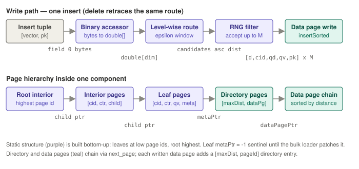

# Patch 3754 p1 — Storage layer of VTree index, patch 1

> **Status:** current
> **Verified against:** `f87cba1ca7` on branch `integrate-newbase` (2026-07-02)
> **Scope:** what patch 1 of [ASTERIXDB-3754] adds — the standalone `hyracks-storage-am-vtree`
> module: frames, VTree core, builders/loaders, navigation — with a data-stream walkthrough of
> an insert descending the tree.

## Commit metadata

- Commit: `f87cba1ca701c361cfc05f6dbfd18d020843f717`, authored 2026-05-17 by Le0shy.
- 56 files, ~8,300 insertions. One new Maven module: `hyracks-storage-am-vtree`
  (`org.apache.hyracks.storage.am.vector.*`), plus a small `hyracks-storage-common` addition
  (`LocalOnlyWriteContext`) and matching `IOManager.localWriteOnly()` support.
- Pure Hyracks: **no AsterixDB dependencies, no LSM dependencies.** This is the single-tree
  engine that patch 2 (`hyracks-storage-am-lsm-vtree`) wraps into an LSM index.

## What layer this patch is

The bottom of the stack: a **single, self-contained clustering tree** — the analog of what
`BTree` is to `LSMBTree`. Everything in it operates on one component: one static navigation
structure plus one set of directory/data pages. It knows nothing about components, flushes,
merges, antimatter reconciliation across trees (that's patch 2), and nothing about ADM,
k-means, or SQL++ (that's 3760 and above). Its public surface is:

- four frame (page) types and their factories,
- `VTree` with insert / delete / search on a single tree,
- `VTreeStaticStructureBuilder` (consumed by 3760's Job 2),
- `VTreeBulkLoader` (consumed by 3760's Job 3) and `VTreeFlushLoader` (consumed by patch 2's
  flush path),
- `VTreeNavigationUtils` (the routing brain used by every reader and writer),
- an `api/` package of 18 interfaces that inverts all AsterixDB-specific concerns upward.

## The four frame types

All extend a common `VTreeNSMFrame` base whose page header adds `cluster_id` (4B, sentinel
`-1` = unassigned) and `centroid_id` (4B) after the standard tree-index header. Each subtype
adds its own fields after that:

| Frame | Extra header | Tuple format | Sort order |
|---|---|---|---|
| `VTreeInteriorFrame` | next_page (4B) + overflow_flag (1B) | `[cid, centroid, childPagePtr]` | insertion |
| `VTreeLeafFrame` | next_leaf (4B) + overflow_flag (1B) | `[cid, centroid, (quantizedBytes), (neighborList), metaPtr]` | insertion |
| `VTreeMetadataFrame` (directory) | next_page (4B) | `[maxDistance, dataPagePtr]` | maxDistance asc |
| `VTreeDataFrame` | next_page (4B) | `[distance, cid, (qDist, qEmbed), pk..., includes...]` | distance asc |

Conventions worth memorizing:

- **The pointer is always the last tuple field** (`childPagePtr` / `metaPtr`), so quantized
  and neighbor-list variants can add fields without moving it. Field indices are documented in
  `VTreeStaticTupleConstants` and `VTreeDataTupleConstants`.
- **Overflow chaining** uses next-page + overflow-flag in interior/leaf frames (a cluster's
  centroids can span pages); directory and data frames chain with next-page only.
- Sorted frames (`VTreeMetadataFrame`, `VTreeDataFrame`) expose `findInsertPosition(...)`
  (binary search) and `insert(tuple, index)`; `VTreeDataFrame` also has
  `split(rightFrame, tuple, index)` for in-place insert overflow. `VTreeMetadataFrame` can
  `updateMaxDistance(index, newMax)` in place — the write-side half of keeping the directory
  sorted (the fix behind the antimatter-reconciliation bug: an unsorted directory breaks the
  k-way merge's sorted-input precondition).

## VTree core (`impls/VTree.java`, ~1,350 lines)

Constructor wiring holds everything injected from above: `vectorDimensions`,
`quantizationParams` (`float[6]`, null = non-quantized), `distanceMetric` +
`IVTreeDistanceFunction(Factory)`, `CrossPollinationConfig`, the frame factories, and the
`IVTreeBinaryAccessorFactory` / `IVTreeDataTupleCreatorFactory` schema bridges.

**Insert** (`insertVector`): extract vector from tuple field 0 → `findReplicaClusters(vector)`
→ for each accepted cluster, compute the distance to *that* cluster's centroid and
`insertIntoDataPages(metadataPageId, ...)` — walk the directory chain, binary-search the data
page whose distance range covers this record (last page is the catch-all), create the storage
tuple via the injected `IVTreeDataTupleCreator`, insert sorted; on a full page,
`handleDataPageOverflow()` allocates and chains a new one, updating the directory.

**`findReplicaClusters`** is where cross-pollination lives on the write path:
- M = 1 (legacy): single closest leaf via root-to-leaf descent.
- M > 1: `VTreeNavigationUtils.findCloseCentroidsLevelWiseGlobalSort()` gathers
  epsilon-filtered candidates level by level, then `RngAcceptanceFilter.accept()` applies the
  SPTAG relative-neighborhood rule — candidate `c_i` is vetoed if an already-accepted replica
  `r` satisfies `rngFactor · dist(c_i, r) < dist(x, c_i)` — keeping up to M *diverse* clusters.
  Falls back to the single closest if everything is vetoed.

**Delete** uses the *same* `findReplicaClusters()` so a delete visits exactly the clusters an
insert wrote to — the replication invariant. Within a cluster it either physically removes the
tuple or relies on the layer above to write antimatter (the antimatter bit itself is a patch-2
concept; this module just stores whatever tuple the creator produces).

**Search** goes through `VTreeSearchCursor` (~970 lines) + `VTreeSearchPredicate` (K, epsilon,
probe fraction, tuple filter), with `VTreeOpContext` holding frames and the optional quantizer.

**`VTreeNavigationUtils`** (~700 lines, stateless static helpers, pins/unpins internally):
`findClosestCentroid()` (root-to-leaf greedy descent), `findCloseCentroidsLevelWiseGlobalSort()`
(epsilon window per level, global sort at the leaf level — the routing primitive used by
bulk-load, DML, and queries alike), and `initializeClusterIterator()` /
`findNextClosestCluster()` (iterative DFS for visiting leaves in increasing distance order).

## VTreeStaticStructureBuilder (~550 lines)

Input contract (matches 3760's k-means emission): tuples arrive **leaf level first, root
last**; within a level, clusters in ascending order; tuple = `[cid, embedding, (quantized),
(neighborList)]`. The builder:

1. Allocates pages via `IPageManager.takePage()` in arrival order — hence **leaves at the
   lowest page ids, root at the highest**.
2. Records each cluster's first page in the `firstPageIdOfCluster[level][cluster]` grid; an
   interior tuple at level L resolves its child pointer by looking up
   `firstPageIdOfCluster[L+1][childClusterIndex]` — always already written, because emission
   is bottom-up.
3. Appends the pointer as the last field of every entry tuple; **leaf metaPtr gets sentinel
   `-1`** because no data exists yet — `VTreeBulkLoader` patches it during Job 3 (leaf index =
   `centroidId − firstLeafCentroidId`).
4. On `end()`: writes the root page id, `num_leaf_centroids`, and `first_leaf_centroid_id`
   into the metadata frame (keys in `VTreeMetadataKeys`).

**The cloud-mode wrinkle — `LocalOnlyWriteContext`:** leaf pages may carry graph
neighbor-lists whose entries can only be resolved to `(pageId, slot)` pointers *after all leaf
pages are placed*. Cloud writers are append-only — you cannot upload a page and then mutate
it. So the builder writes leaf pages through a FIFO writer using the new
`LocalOnlyWriteContext` (which calls `IOManager.localWriteOnly()`, skipping the cloud upload
queue), then `resolveAndUploadLeafNeighbors()` re-reads the local pages, resolves the
provisional entries, and flushes each page exactly once. Off-cloud, local-only writes are just
normal writes.

## The two loaders

**`VTreeBulkLoader`** (~630 lines) — cluster-at-a-time streaming for the first disk component
(driven by 3760's Job 3 through the LSM layer): data pages get real page ids immediately and
are written as they fill; **directory pages are confiscated with `INVALID_DPID`** and parked
in a `pendingDirectoryPages` list, because their count isn't known until the cluster ends —
`finalizeClusterDirectory()` then assigns real ids, chains them, writes them, and records the
first one in `clusterFirstDirPageId[clusterIndex]`. At `end()`, the static-structure pages
are streamed from the still-open source component **one source/destination page pair at a
time** — pin source, copy into a single confiscated destination page, release, patch
(interior child pointers offset, leaf metaPtrs patched from `clusterFirstDirPageId`,
graph-neighbor entries resolved against a pass-1 cid → (page, slot) map), write — so the
loader holds O(1) pages plus an O(K) id map; there is no init-time byte[] snapshot.

**`VTreeFlushLoader`** (~260 lines) — the LSM flush path (used by patch 2): copies the memory
component's virtual-buffer-cache pages to disk with **identity mapping** (VBC page N → disk
page N — no pointer rewriting needed for data/directory pages), then appends the static
structure the same bounded way (one source/destination page pair at a time) with child
pointers offset by the base page id and leaf metaPtrs taken from the memory tree's
`centroidDirPageMap`.

## The `api/` interface surface — dependency inversion

18 interfaces so this module needs zero knowledge of ADM, quantization math, or distance
metrics. The four that AsterixDB implements (see the 3760 walkthrough for the implementations):

| Interface | Abstracts | AsterixDB impl (3760) |
|---|---|---|
| `IVTreeBinaryAccessor(Factory)` | serialized bytes → `double[]` | `AOrderedListVectorBinaryAccessor` |
| `IVTreeQuantizer(Factory)` | `double[]` ↔ quantized bytes | `ScalarVectorQuantizer` / `OptimizedScalarQuantizerFactory` |
| `IVTreeDistanceFunction(Factory)` | metric string → distance fn | `VectorDistanceFunctionFactory` |
| `IVTreeDataTupleCreator(Factory)` | operator tuple → storage tuple | `VTreeDataTupleCreator` (this module) via resource config |

Factories are `Serializable` and are persisted on the local resource (patch 2) so a restarted
NC reconstructs identical behavior; query-time overrides arrive via the index-access-parameters
map (e.g. `VECTOR_QUANTIZER_FACTORY`).

## Data-stream walkthrough: one insert

Take the 3-leaf toy tree from the 3760 walkthrough (leaves `cid 1..3` under root `cid 0`) with
`cross_pollination_m = 2`, and insert pk=7 with embedding `x = [0.30, 0.30, 0.70, 0.65]`:

1. **Extract**: the injected binary accessor turns tuple field 0 into `double[4]`.
2. **Route**: level-wise search with epsilon = 0.3 → leaf distances
   `cA = 0.32`, `cC = 0.34`, `cB = 1.15`; the epsilon window keeps `{cA, cC}`.
3. **Thin**: RNG filter — accept `cA` (closest); for `cC`, check
   `rngFactor · dist(cC, cA) < dist(x, cC)` → `1.0 · 1.02 < 0.34` is false, so `cC` is **not**
   vetoed and is accepted too. Two replicas.
4. **Write to cA's cluster**: pin the leaf tuple's `metaPtr` directory page; the directory
   reads `[(0.087, p3)]`; the record's distance 0.32 exceeds the last entry's range → catch-all
   last data page p3; the tuple creator builds
   `[0.32, 1, qDist, qBytes, "7", ...]`; `insertSorted` places it after the 0.087 tuple;
   directory entry's maxDistance is updated in place to 0.32 to keep the directory truthful.
5. **Write to cC's cluster**: same flow with distance 0.34 relative to `cC` — note the stored
   distance is *per replica cluster*, not global.
6. A later **delete** of pk=7 recomputes the same two clusters from the same vector and
   removes/cancels the tuple in both — which is exactly why the config that feeds routing must
   be identical on insert and delete paths.

## Design theses

1. **Distance-bucketed clusters, not key-ordered pages.** Data pages are sorted and chained by
   distance-to-centroid, with a directory keyed by max distance — the layout exists to serve
   triangle-inequality pruning and range-limited scans, not point lookups.
2. **Bottom-up, append-only construction.** Emission order (leaves→root) is chosen so every
   pointer can be resolved at write time from the `firstPageIdOfCluster` grid, with exactly one
   class of deferred pointer (leaf metaPtr) patched by the one loader that knows the answer.
3. **One routing function for all writers and readers.** Bulk load, insert, delete, and query
   all route through `VTreeNavigationUtils` + `RngAcceptanceFilter` with the same config —
   replication correctness is by construction, not by bookkeeping.
4. **Everything AsterixDB-specific is injected.** The module compiles against `double[]` and
   `ITupleReference` only.

## Caveats

- Rebased commit: this version already contains the graph-leaf-neighbors plumbing
  (`VTreeLeafNeighborList`, neighbor resolution passes) and the distance-injection design
  (`IVTreeDistanceFunctionFactory`) that landed after the original patchset, as well as
  `LocalOnlyWriteContext` cloud support.
- Frame terminology drift: `VTreeMetadataFrame` is the class name, but loaders/docs call these
  **directory pages**; the *index metadata page* (root id, centroid counts) is a different,
  page-manager-level concept.
- Non-quantized tuple variants still exist in the frame code but are deprecated
  product-wise (quantized-only at release).
