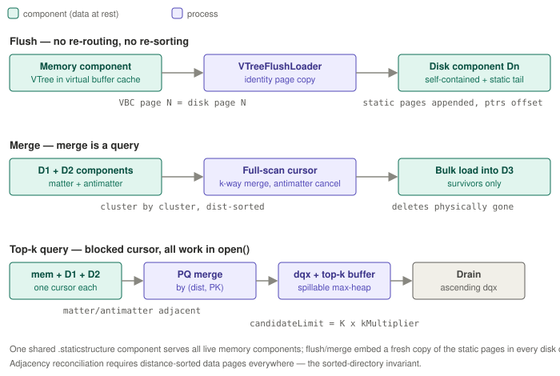

# Patch 3754 p2 — Storage layer of VTree index, patch 2

> **Status:** current
> **Verified against:** `111bfcd146` (2026-07-05)
> **Scope:** what patch 2 of [ASTERIXDB-3754] adds — the `hyracks-storage-am-lsm-vtree`
> module: the LSM wrapper around VTree (components, flush, merge, cursors, resource
> persistence) — with data-stream walkthroughs of flush, merge, and a top-k query.

## Commit metadata

- Commit: `8ccd96d69d1048599d0a96e240fa064eda218e52`, authored 2026-05-17 by Le0shy.
- 39 files, ~7,150 insertions. One new Maven module: `hyracks-storage-am-lsm-vtree`
  (`org.apache.hyracks.storage.am.lsm.vector.*`), plus `IQuantizedResource` in
  `hyracks-storage-am-common` and `LSMVTreeComponentFileReferences` in
  `hyracks-storage-am-lsm-common`.

## What layer this patch is

Patch 1 gave us a single tree; patch 2 makes it a **database index**: many components with a
lifecycle (memory → flush → disk → merge), durable configuration that survives restarts,
antimatter-based deletes reconciled across components, and the operator-facing search
entry points. It is the analog of `LSMBTree` over `BTree`. Everything above (3760's job
builders, the resource factory provider) talks to *this* module's `LSMVTreeUtils.createLSMTree`,
`LSMVTreeLocalResourceFactory`, and operator descriptors.

## The component model — and the special `.staticstructure` component

`LSMVTree` (~680 lines) holds:

- **Memory components** (`LSMVTreeMemoryComponent`): one VTree per virtual buffer cache,
  built with the *insert* data-frame factory. On recycle, `cleanup()` calls
  `vtree.resetInitialization()` and `doAllocate()` re-wires the static structure.
- **Disk components** (`LSMVTreeDiskComponent`): a materialized VTree from flush, bulk load,
  or merge.
- **One special static-structure component.** The trained navigation tree (3760 Job 2 output)
  is itself loaded as an `LSMVTreeDiskComponent` with `isStaticStructure = true`.
  `addBulkLoadedDiskComponent()` dispatches on that flag: a static-structure component goes to
  `setStaticStructure()` instead of the `diskComponents` list. There is **one shared
  `.staticstructure` file per index** (`LSMVTreeFileManager`, suffix `.staticstructure`,
  implicit component sequence [0,0]) — not one per component. `validateStaticStructureFile()`
  decides on recovery whether existing VTree component files are usable or orphaned.
- When the static structure arrives (or a memory component is recycled),
  `reinitializeMemoryComponent()` gives the memory VTree an accessor to the static component
  via `vTree.setStaticStructure(staticAccessor)` — so **memory-component inserts navigate the
  shared trained tree** rather than each memory tree carrying its own copy.

`LSMVTreeDiskComponent.createBulkLoader()` dispatches on operation parameters: if
`PARAM_NUM_LEVELS`/`PARAM_CLUSTERS_PER_LEVEL`/`PARAM_CENTROIDS_PER_CLUSTER` are present it
builds a static-structure loader; otherwise a regular `VTreeBulkLoader` (which requires
`PARAM_STATIC_STRUCTURE_COMPONENT` to know the tree it routes against).

## DML path

`LSMVTree.modify()` routes INSERT / DELETE / PHYSICALDELETE to the current mutable
component's pre-created `VTreeAccessor` (held in `LSMVTreeOpContext`). The actual
cross-pollination fan-out (M replica clusters via level-wise search + RNG filter) happens
inside patch 1's `VTree.insertVector`/`deleteVector` — this module contributes the
**antimatter encoding**:

- `LSMVTreeDataTupleWriter`: layout `[null/antimatter flags][field slots][fields]` with
  **bit 7 (0x80, the most-significant bit) of the first flag byte = antimatter**
  (`ANTIMATTER_BIT_OFFSET = 7`); user-field null bits shift up by one (`getAdjustedFieldIdx()`).
- `LSMVTreeDataTupleWriterFactory` produces a matter writer (insert frames) and an antimatter
  writer (delete frames) — which is why `LSMVTreeUtils` wires *two* data-frame factories into
  every VTree.
- A delete therefore *inserts* an antimatter tuple into the memory component, routed to the
  same M clusters as the original insert; reconciliation happens at read/merge time.

## Flush and merge

**Flush** (`doFlush`): the beauty is what it *doesn't* do — no re-routing, no re-sorting.
`VTreeFlushLoader` copies every VBC page of the flushing memory VTree to the new disk
component with **identity page mapping** (VBC page N → disk page N), so all intra-component
pointers (directory chains, data-page chains) remain valid byte-for-byte. Then it appends the
static-structure pages at the end (interior child pointers offset by the base page id, leaf
metaPtrs taken from the memory tree's `centroidDirPageMap`) and finalizes with
`end(numLeafCentroid, firstLeafCentroidId, rootPageId)`. Every disk component is thereby
self-contained: it embeds its own copy of the navigation tree.

**Merge** (`doMerge`): opens `LSMVTreeSearchCursor` in **full-scan mode** over the merging
components (`epsilon = 0`, sequential cluster iteration, `returnDeletedTuples = true`), and
drains it into a fresh component bulk loader whose parameters point at the shared static
structure. Because the cursor's k-way merge emits tuples cluster-by-cluster in distance order
and reconciles matter/antimatter on the way, **the merge is just "search everything, bulk-load
what survives"** — one code path serves both queries and compaction.

## The two cursors

- **`LSMVTreeSearchCursor`** (~1,100 lines) — streaming k-way merge across components. Two
  modes: query mode (nprobe/DFS cluster selection via `NprobeClusterSelectionStrategy`, early
  termination, INCLUDE filtering) and full-scan mode (merge; `SequentialClusterSelectionStrategy`,
  lock-step cluster advancement, antimatter visible). Per project decision, this cursor is
  **merge-only** at release; queries use the top-k cursor.
- **`LSMVTreeTopKSearchCursor`** (~750 lines) — the sole *query* cursor. Blocked design: all
  work happens in `open()` — it opens one `VTreeSearchCursor` per component, runs the same
  priority-queue merge keyed by ⟨distance, PK⟩ (which makes matter/antimatter pairs adjacent
  so deletes cancel during the merge — the "adjacency reconciliation" design), computes the
  **approximate query distance `dqx`** from each tuple's quantized embedding, and pushes
  survivors into a `SpillableTopKBuffer` (in-memory max-heap of `candidateLimit = K ×
  kMultiplier` entries with disk spill). `hasNext()/next()` just drain a
  `SpillableTopKDrainIterator` in ascending `dqx`. Cluster advancement stops when the
  selection strategy says the nprobe/K budget is satisfied.
- Support cast: `PKOnlyTupleProjector(Factory)` for PK-based antimatter matching,
  `VectorSearchHeapEntry(Factory)`, `IClusterSelectionStrategy` +
  `Nprobe`/`Sequential` implementations, `IVectorSearchCursor`,
  `LSMVTreeCursorInitialState`.
- `LSMVTreeIndexAccessor` picks the cursor: if the index-access-parameters map carries the
  vector-search key it creates the top-k cursor, else the streaming cursor.

## Dataflow package — durable config and operator entry points

- **`LSMVTreeLocalResource`** (~430 lines, implements the new `IQuantizedResource`): the
  JSON-persisted identity of the index. Round-trips: vector dimensions/fields, distance
  metric string, **distance-function factory** and **vector-accessor factory** (via
  `IPersistedResourceRegistry`), the six quantization params (written later by Job 1 through
  `setQuantizationParameters()` — `IndexBuilder` injects them into any `IQuantizedResource`),
  and the three cross-pollination values. `fromJson()` infers `isQuantized` from the presence
  of `minQuantile` and builds the matching `VTreeDataTupleCreatorFactory`. `createInstance()`
  packs the params into the `float[6]` and calls `LSMVTreeUtils.createLSMTree(...)`.
- **`QuantizedIndexCreateOperatorDescriptor`**: the Job-1/Job-2 entry point — creates the
  index and drives the static-structure bulk load with the structure parameters.
- **`VectorSearchOperatorDescriptor` / `NodePushable`**: the query-side entry point — builds
  the search predicate, injects accessor/quantizer factories via IAP, opens the top-k cursor.
- `LSMVTreeUtils.createLSMTree()` is the single assembly point: four frame factories,
  matter/antimatter tuple-writer pair, `VTreeFactory`, `LSMVTreeFileManager`, disk component
  factory, and the `LSMVTree` itself.

## Data-stream walkthroughs

Continuing the toy index (leaves cid 1–3, root cid 0; records pk 1–6 bulk-loaded; pk 7
inserted into clusters cA and cC with `M = 2`).

**A delete reaching disk.** `DELETE pk=1` arrives: the memory component's VTree routes
`[0.10, 0.20, 0.90, 0.80]` to cluster cA (M = 1 here), and an **antimatter** tuple
`[0.022, 1, qd, qv, "1"]` (flag bit 0 = 1) is insert-sorted into cA's data page in the VBC.
The disk component still holds the matter twin. **Flush**: the VBC pages are copied
one-for-one into disk component D2 — the antimatter tuple is now durable. **Query before
merge**: the top-k merge sees D2's antimatter `⟨0.022, "1"⟩` and D1's matter `⟨0.022, "1"⟩`
adjacent in the priority queue (same distance key, same PK) and cancels both — pk 1 is
invisible. **Merge**: the full-scan cursor does the same cancellation while draining D1+D2
into D3; the pair is physically gone from D3, and D3's tail gets a fresh copy of the static
pages. (This adjacency only works because every writer keeps data pages distance-sorted —
the unsorted-directory bug fixed in `VTree.updateMetadataWithNewDataPage` was exactly a
violation of this precondition.)

**A top-k query.** `k = 2, query q = [0.1, 0.2, 0.9, 0.8]` with one memory + two disk
components: `open()` builds three `VTreeSearchCursor`s, the nprobe strategy picks starting
cluster cA on each, the PQ merges the three streams by ⟨distance, PK⟩, each surviving tuple
gets `dqx` computed from its stored quantized embedding against the quantized query, and the
best `candidateLimit` land in the spillable heap. The strategy declines to advance past cA
(budget met), `open()` returns, and `next()` drains pk 1, pk 2 in ascending `dqx`.

## Design theses

1. **One tree per component, one shared trained brain.** Every disk component embeds its own
   static-structure copy (self-contained, mergeable), while live memory components share the
   single `.staticstructure` component through an accessor — training happens once.
2. **Flush is a memcpy, not a rebuild.** Identity page mapping makes flush O(pages) with zero
   routing work; all clustering effort was already paid at insert time.
3. **Merge is a query.** Full-scan mode of the search cursor *is* the merge pipeline —
   antimatter reconciliation logic exists in exactly one place.
4. **Deletes are inserts with a bit set**, routed by the same cross-pollination function, so
   replica consistency needs no bookkeeping.
5. **The resource JSON is the index's genome.** Metric, factories, quantization constants,
   and cross-pollination config all round-trip through it — behavior is reproducible after
   restart without re-reading any metadata service.

## Caveats

- Rebased commit: includes post-original fixes — the JSON-persisted distance-function factory
  (dependency inversion replacing storage-side `VectorUtils`), the merge-path null-metric NPE
  fix, and the sorted-directory insert fix implied by the adjacency-reconciliation design.
- `LSMVTreeSearchCursor`'s query mode still exists in code but is retired product-wise:
  **top-k cursor is the sole search path; streaming cursor is merge-only.**
- Known open issues in this layer (tracked in memory/bug notes, not in this doc): AIOOBE in
  `tryPhysicalDelete` with large buffer caches; post-compact recall anomaly at
  fraction = 0.4.
