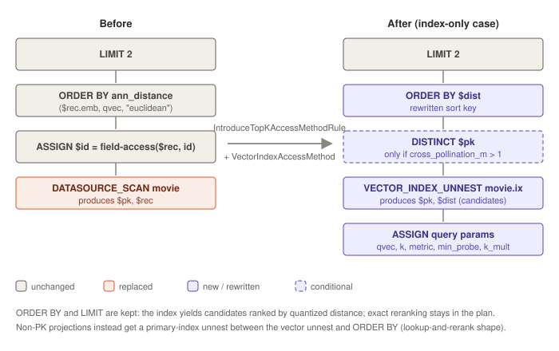

# Patch 3771 — ANN query optimizer rule for top-k vector search

> **Status:** current
> **Verified against:** `e36bfa0681` on branch `integrate-newbase` (2026-07-02)
> **Scope:** what [ASTERIXDB-3771] adds — the query-side compiler stack (optimizer rules,
> physical operator, runtime function, DML maintenance) plus, on this rebased branch, the DDL
> surface — with a plan-transformation walkthrough.

## Commit metadata

- Commit: `e36bfa06819e6ccbb2d630ca1e18bdbf20e7da66`, authored 2026-05-26 by Le0shy.
- 38 files, ~4,500 insertions across `asterix-algebra` (the bulk), `asterix-lang-sqlpp`/
  `asterix-lang-common`, `asterix-metadata`, `asterix-app`, `asterix-runtime`, and one enum
  value in `algebricks-core`.
- **User model changes: yes** — the only patch in the stack that touches what users type.

## What layer this patch is

The top of the stack. 3754 built the engine, 3760 built the index; 3771 makes the index
**reachable from SQL++** — in both directions:

- **Read path:** recognize `ORDER BY ann_distance(...) LIMIT k` and swap the dataset scan for
  a vector-index search, keeping the sort/limit for exact reranking.
- **Write path (DDL + DML):** on this rebased branch, this commit also carries the grammar
  (`SQLPP.jj` `<VECTOR>` annotation + `TYPE VTREE`, +176 lines), `VectorIndexDeclUtil`
  (WITH-clause validation), `QueryTranslator`'s three-job creation orchestration (+112),
  metadata persistence of `VectorIndexDetails` (`IndexTupleTranslator`, +284), and the
  DML-maintenance branch so inserts/deletes keep the index up to date.

## Read path: the two rules and the physical operator

### `IntroduceTopKAccessMethodRule` (~980 lines, `optimizer/rules/am/`)

Registered in `RuleCollections` in the **access-method phase**, between
`IntroduceSelectAccessMethodRule` and `IntroduceJoinAccessMethodRule`. It matches

```
LIMIT k → … → ORDER BY ann_distance(field, qvec, metric [, min_probe_fraction [, k_multiplier]]) → … → DATASOURCE_SCAN
```

tolerating intermediate ASSIGN/EXCHANGE operators, requiring exactly one ORDER expression.
`ann_distance` args: field ref, query vector (constant), metric string (normalized:
l2→euclidean, etc.), optional `min_probe_fraction` (default 0.1, clamped to [0,1]) and
`k_multiplier` (default 1). Candidate `IndexType.VTREE` indexes come from
`fillSubTreeIndexExprs()`; the **query metric must match the index's `similarity`** or the
rule declines and the query falls back to a full scan (warning logged).

Its most subtle job is the **index-only detection** (`isProjectionPkOnly`): trace every
variable live above the LIMIT through ASSIGN bindings; if all resolve to PK variables,
constants, or `field-access($rec, pk)`, the secondary index can answer the query alone —
conservative on composite PKs, meta records, and external sources. It also checks whether a
SELECT between ORDER and scan touches only the index's INCLUDE fields (feeding the filter
rule below). Plan construction is delegated to `VectorIndexAccessMethod`.

### `VectorIndexAccessMethod` (~1,080 lines)

Implements `IAccessMethod` for `ANN_DISTANCE` and builds the replacement plan
(`createIndexSearchPlan`):

1. **AssignOperator** binding five fresh variables: query vector, k (pulled from LIMIT),
   metric, min_probe_fraction, k_multiplier — serialized into **`VectorJobGenParams`**
   (extends `AccessMethodJobGenParams`; adds `indexOnly` flag + the 5-var list, slot [5]
   reserved for a `search_approach` discriminator: 0 = ann_distance, 4 = vector_distance).
2. **Vector-index unnest-map** producing `[pk…]` — or `[pk…, dist]` in index-only mode.
3. Then one of two shapes:
   - **Lookup-and-rerank** (default): a primary-index unnest-map fetches full records from
     the candidate PKs; ORDER BY ann_distance re-evaluates on the real vectors.
   - **Index-only**: no primary lookup; ORDER BY is rewritten to sort on the emitted `$dist`
     variable, `field-access($rec, pk)` occurrences are rewritten to the new PK variables,
     dangling expressions neutralized, and types recomputed bottom-up.
4. **DistinctOperator on PKs** is spliced in **iff `cross_pollination_m > 1`** (read from the
   index's WITH object) — replicated records would otherwise appear once per replica cluster.
   This is the index-only duplicate fix.

**ORDER BY and LIMIT are never removed.** The unnest-map yields *candidates* (possibly more
than k, ranked approximately by quantized distance); the retained ORDER BY recomputes exact
distances and LIMIT takes the true top-k. Correctness never depends on the index's ranking —
only recall does. This mirrors the B+Tree/R-Tree design: swap the scan, keep the sort.

### `PushFilterIntoVectorSearchRule` (~460 lines) + filter plumbing

A separate rule in `physicalRewritesTopLevel` (after `PushLimitIntoPrimarySearch`). Matches a
SELECT over INCLUDE-field predicates sitting above the primary unnest, inlines ASSIGN vars
into the condition, rewrites the field accesses to fresh variables, and attaches the
condition to the **vector** unnest-map (`selectCondition`) with two annotations: filter var →
physical field index (`VECTOR_FILTER_VAR_MAPPING`) and filter var → type
(`VECTOR_FILTER_VAR_TYPES`). At codegen, `VectorIndexFilterSchema` (offsets filter fields
past the 2/4 secondary key fields) and `VectorIndexFilterTypeEnvironment` (supplies types for
variables not in the operator's own schema) let the stock `ITupleFilterFactory` machinery
compile the predicate — so the storage cursor filters candidates **before** the top-k buffer,
preserving recall under selective filters. Pushing filters that reference the full `$row` is
deliberately not supported (the record is produced downstream by the primary lookup).

### `VectorSearchPOperator` (~160 lines) + `MetadataProvider.getVectorSearchRuntime()`

New `PhysicalOperatorTag.VECTOR_SEARCH`, assigned by `SetAsterixPhysicalOperatorsRule` to
vector-index unnest-maps. At job gen it deserializes `VectorJobGenParams`, resolves the five
query fields against input schemas, decides quantized (4 secondary key fields) vs not (2)
from the index WITH object, compiles the pushed filter if present, and calls
`MetadataProvider.getVectorSearchRuntime()` — which instantiates patch 2's
`VectorSearchOperatorDescriptor` with the three injected factories
(`AOrderedListVectorBinaryAccessorFactory`, `VectorDistanceFunctionFactory`,
`OptimizedScalarQuantizerFactory`), partition map, kMultiplier, epsilon, and the indexOnly
flag. Two compiler knobs arrive here: `compiler.vector.prunedsearch` and
`compiler.vector.kmultiplier` (`CompilerProperties`).

## Runtime fallback: `ANNDistanceDescriptor`

`ann_distance` is also a real scalar function (`asterix-runtime/.../vector/
ANNDistanceDescriptor.java`), so an unoptimized query still works as an exact exhaustive KNN:
metric resolved at compile time from the constant third argument (case-insensitive), mapped
to `VectorDistanceCalculation` — with **dot product negated** so smaller = more similar
matches the index convention (the sign bug fixed in the history). Registered in
`FunctionCollection`/`BuiltinFunctions`; 3–5 args, extra args ignored by the fallback.

## Write path: DML maintenance

`IntroduceSecondaryIndexInsertDeleteRule` (+77) teaches insert/delete/upsert plans to feed
the VTREE index: secondary-key expressions are generated as
`[vector_field, include_1 … include_N, pk…]` (types from the schema, ANY for open fields;
upsert additionally builds the previous-tuple keys). Downstream, the storage layer's
`VTree.insertVector`/`deleteVector` (patch 1) does the routing — including cross-pollination
replication — so the optimizer layer only needs to deliver the raw vector and payload.

## Plan walkthrough



Query against the toy index (euclidean, SQ8, `cross_pollination_m = 1`, B-tree-less):

```sql
SELECT m.id FROM movie m
ORDER BY ann_distance(m.embedding, [0.1, 0.2, 0.9, 0.8], "euclidean")
LIMIT 2;
```

Before (logical):

```
LIMIT 2
└─ ORDER BY ann_distance($rec.embedding, [0.1,…], "euclidean")
   └─ ASSIGN $id ← field-access($rec, "id")
      └─ DATASOURCE_SCAN movie → $pk, $rec
```

`isProjectionPkOnly`: `$id` traces to `field-access($rec, id)` where `id` *is* the PK →
**index-only**. After the rule:

```
LIMIT 2
└─ ORDER BY $dist                      ← rewritten from ann_distance(…)
   └─ VECTOR_INDEX_UNNEST movie.ix → $pk', $dist
      └─ ASSIGN $qv ← [0.1,…], $k ← 2, $metric ← "euclidean",
                $mpf ← 0.1, $kmult ← 1
```

At runtime the unnest-map opens patch 2's `LSMVTreeTopKSearchCursor`, which returns
candidate `(pk, dqx)` pairs — for the toy data, pk 1 (dqx ≈ 0.021) and pk 2 (dqx ≈ 0.076)
from cluster cA. ORDER BY sorts the two candidates by `$dist`, LIMIT 2 passes both. Had the
query projected `m.title` (non-PK), the plan would instead insert a primary-index unnest
between the vector unnest and the ORDER BY, and the ORDER BY would keep evaluating
`ann_distance` on the fetched records exactly. With `cross_pollination_m = 3`, a
DISTINCT($pk') sits directly above the vector unnest so pk 7's two replicas collapse to one
candidate before reranking.

## Design theses

1. **The index proposes, the plan disposes.** ORDER BY + LIMIT survive the rewrite, so the
   final ordering is always exact over whatever candidates the index yields — approximation
   affects recall, never ranking correctness.
2. **Index-only is an analysis, not a mode.** It's derived by proving every live variable is
   PK-derivable, then earned by rewriting the sort key to the index-emitted distance —
   deleting the primary lookup entirely.
3. **Replication is invisible to queries** only because the optimizer knows about it: the
   conditional DISTINCT is the query-side half of the cross-pollination contract.
4. **Metric identity is enforced at plan time.** A query whose metric disagrees with the
   index's DDL metric silently gets the exact full-scan plan rather than wrong-ranked index
   results.
5. **Fallback is first-class.** `ann_distance` computes real distances without the index, so
   plans, tests, and un-indexed datasets all behave — the optimizer is an accelerator, not a
   dependency.

## Caveats

- Rebased commit: on `integrate-newbase` this change absorbed the DDL/grammar/metadata
  surface and later fixes (index-only Distinct for cross-pollination, dot-product negation in
  the fallback evaluator, the `search_approach` slot for the dual-navigation experiment).
  The original Gerrit patchset was narrower.
- `VectorIndexAccessMethod` recognizes `EUCLIDEAN_DISTANCE`/`COSINE_DISTANCE`/`DOT_PRODUCT`
  identifiers but only `ANN_DISTANCE` is wired end-to-end.
- Filter pushdown covers INCLUDE-field predicates only; predicates over the full record
  cannot be pushed (the record doesn't exist below the primary lookup) — they remain as a
  post-filter SELECT, which can hurt recall for selective filters unless kMultiplier
  compensates.
- Join-shaped ANN patterns (ann_distance in a join condition) are out of scope; only the
  select/order-by/limit pipeline is matched.
