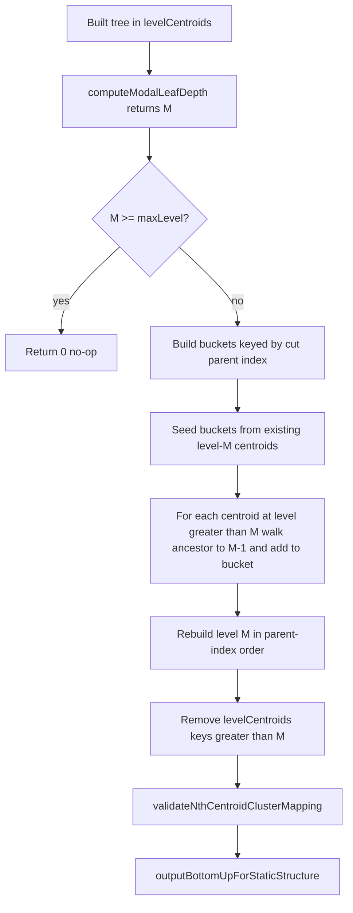

# SPANN in AsterixDB: Current Algorithm Report

## Scope

This report describes the current SPANN-oriented VTREE implementation in this branch, including:

- Build-time top-down tree creation (`SelectHead` + `BuildHead`)
- Static-structure materialization and data loading
- Query-time ANN top-k execution path
- Configuration knobs and how they influence tree shape
- Lambda-balanced k-means and the scratch BKT used for head selection
- Global modal branch flatten before operator handoff

---

## Core Components

### Build orchestration

- `asterixdb/asterix-metadata/src/main/java/org/apache/asterix/metadata/utils/SecondaryVectorOperationsHelper.java`
  - Creates job specs for index creation, static-structure build, and data loading.
  - Resolves top-down and SelectHead tuning via `resolveTopDownTuning()` and `resolveSelectHeadTuning()`.
  - Wires: sample scan → `HierarchicalKMeansPlusPlusCentroidsOperatorDescriptor` → `VTreeStaticStructureCreatorOperatorDescriptor`.

### Top-down hierarchical clustering and SPANN head selection

- `asterixdb/asterix-runtime/src/main/java/org/apache/asterix/runtime/operators/HierarchicalKMeansPlusPlusCentroidsOperatorDescriptor.java`
  - Main phases:
    - `runSelectHeadPhase(...)` — scratch BKT + head walk
    - `materializeHeadRunFile(...)` — compact head-only run file
    - `buildTopDownHierarchicalKMeans(...)` — routing tree from heads or full sample
    - `outputBottomUpForStaticStructure(...)` — leaf-first emission for static builder
  - Internal representation:
    - `HierarchicalClusterStructure` with `levelCentroids` (level `0` = root in top-down flow)
    - `CentroidInfo` per routing node

### Static structure consumer and builder handoff

- `asterixdb/asterix-runtime/src/main/java/org/apache/asterix/runtime/operators/VTreeStaticStructureCreatorOperatorDescriptor.java`
  - Consumes hierarchical tuples: `[treeLevel, centroidId, parentClusterId, embedding]`
  - Infers `clustersPerLevel`, `centroidsPerCluster`, `numLevels`
  - Converts to builder format and bulk-loads static pages.

### Storage-side static builder and search

- `hyracks-fullstack/hyracks/hyracks-storage-am-vtree/.../VTreeStaticStructureBuilder.java`
- `hyracks-fullstack/hyracks/hyracks-storage-am-lsm-vtree/.../LSMVTreeTopKSearchCursor.java`
- `hyracks-fullstack/hyracks/hyracks-storage-am-lsm-vtree/.../NprobeClusterSelectionStrategy.java`

---

## End-to-End Build Pipeline

```
sample/full scan
  → HierarchicalKMeansPlusPlusCentroidsOperatorDescriptor
       [SelectHead: scratch BKT → head walk → head run file]
       [BuildHead / TopDown: level-wise lambda-balanced splits]
       [Global mode flatten: promote deeper pivots into level M]
       [Emit: outputBottomUpForStaticStructure]
  → VTreeStaticStructureCreatorOperatorDescriptor
  → VTreeStaticStructureBuilder (disk pages)
  → VTreeBulkLoaderAndGroupingOperatorDescriptor (data assignment + bulk load)
```

---

## Configuration Knobs and Their Roles

Knobs fall into three layers: **DDL WITH clause**, **session SET parameters**, and **hard-coded build constants**. Together they control sample size, head selection, split fan-out, tree height, cluster balance, and quantization-aware leaf capacity.

### DDL WITH clause (index declaration)

| Parameter | Default / typical | Role in SPANN tree build |
|-----------|-------------------|--------------------------|
| `top_down` | `"true"` | When true (default), use BKT-style top-down build. `"false"` selects legacy bottom-up k-means. |
| `num_clusters` | user-defined (e.g. 1000) | **Full-sample top-down only:** stop when a level's centroid count ≥ target. **Ignored for BuildHead** when SelectHead is enabled (default). |
| `quantization` | `"SQ8"` | Determines bit width (SQ4=4, SQ8=8) used to compute **leaf page capacity** — the primary physical stop condition for splits. |
| `dimension` | required | Vector dimension; used for frame sizing and distance computation. |
| `similarity` | e.g. `"euclidean"` | Distance metric for k-means assignment and pivot selection. |

Example:

```sql
CREATE INDEX vecIdx ON myDataset(embedding) TYPE vtree
WITH {
  "num_clusters": 1000,
  "dimension": 384,
  "similarity": "euclidean",
  "quantization": "SQ8",
  "top_down": "true"
};
```

### Session SET parameters — top-down tuning

Resolved in `SecondaryVectorOperationsHelper.resolveTopDownTuning()` and passed into the hierarchical operator constructor.

| SET key | Default | Role |
|---------|---------|------|
| `compiler.vector.topdown.lambdaFactor` | auto (`-1`) | Balance factor for lambda-balanced k-means. When omitted or ≤0, **auto-tuned once per partition** via `dynamicFactorSelect()`. When set to a positive value, that fixed factor is used for all splits in SelectHead scratch BKT, BuildHead, and full-sample top-down. |
| `compiler.vector.topdown.maxlevel` | `5` (operator default; docs often cite deepest index `4`) | **Safety height cap.** Loop stops when `level >= maxLevel`. BuildHead also stops earlier when all pending buckets fit on one leaf page. |

Deprecated (no effect): `compiler.vector.topdown.v`, `compiler.vector.topdown.gamma`.

### Session SET parameters — SelectHead / BuildHead

Resolved in `SecondaryVectorOperationsHelper.resolveSelectHeadTuning()`.

| SET key | Default | Role |
|---------|---------|------|
| `compiler.vector.selecthead.enabled` | `true` | When true, run SelectHead then BuildHead on head vectors only. When false, skip head selection and build from the full training sample. |
| `compiler.vector.selecthead.headRatio` | `0.12` | Target fraction of sample records to keep as heads: \|H\| ≈ ratio × sampleCount. Drives `selectThreshold`, `splitThreshold`, and `splitFactor` in the head walk. |
| `compiler.vector.selecthead.headCount` | unset | If set (>0), overrides ratio: effective ratio = headCount / sampleCount. |
| `compiler.vector.selecthead.selectType` | `"bkt"` | `"bkt"` = scratch BKT + dynamic head walk (SPANN-style). `"random"` = uniform random sample of `targetHeadCount` indices. |
| `compiler.vector.selecthead.bktLeafSize` | unset | Optional scratch BKT leaf stop threshold for SelectHead; when unset, page-derived leaf capacity is used. |

**Important interaction:** BuildHead **re-tunes λ independently** on the head subset when `lambdaFactor` is auto. SelectHead scratch BKT and BuildHead therefore may use different tuned λ values on the same partition.

### Hard-coded build constants

| Constant | Value | Role |
|----------|-------|------|
| `BKT_KMEANS_K` | 32 | Maximum children per k-means split. Also the **fixed fan-out** for BuildHead (`headOnlyBuild=true`, SPANN `dynamicK=false`). |
| `BKT_SAMPLES` | 1000 | Cap on records used for per-split k-means optimization (sample-based assignment iterations). Full-data assign always uses all records with λ=0. |
| `BKT_TRY_ITERS` | 3 | Random-restart trials in `initCenters()` when seeding k-means centers. |
| `BKT_MAX_ITERS` | 100 | Maximum k-means refinement iterations per split. |
| `BKT_CONV_EPS` | 1e-3 | Center movement convergence threshold. |
| `BKT_NO_IMPROVE` | 5 | Early stop when total assignment cost stops improving. |
| `DEFAULT_HEAD_RATIO` | 0.12 | Default head fraction when SET not provided. |
| `DEFAULT_TOPDOWN_LAMBDA_FACTOR` | -1.0 | Sentinel for auto-tune. |
| `DEFAULT_TOPDOWN_MAX_LEVEL` | 5 | Default max level passed from metadata helper. |
| `TRAIN_LIST_MIN_SAMPLE_SIZE` | 10000 | Below this sample size → full dataset scan for structure build. |
| `TRAIN_LIST_MAX_SAMPLE_SIZE` | 1000000 | Upper cap on training sample. |

### Query-time knobs (not build, but part of SPANN search behavior)

| SET key | Role |
|---------|------|
| `compiler.vector.prunedsearch` | Enables pruned vector search approach at runtime. |
| `compiler.vector.kmultiplier` | Multiplier on k for nprobe / candidate expansion during ANN search. |

---

## Leaf Page Capacity — The Physical Stop Condition

Most split/stop decisions ultimately compare record counts against **how many quantized leaf routing entries fit on one disk page**.

Computed in `computeLeafPageCapacity(ctx, dim)`:

```
perEntryBytes = leafFrame.getBytesRequiredToWriteTuple([centroidId, embedding, quantizedBytes, childPageId])
leafPageCapacity = max(1, floor((pageSize - leafHeaderSize) / perEntryBytes))
```

- `quantization` (SQ4 vs SQ8) directly affects `perEntryBytes` and therefore tree depth.
- A bag with `recCount <= leafPageCapacity` becomes a **leaf bag**: each record is emitted as its own real-pivot centroid (no further k-means split at that node).
- BuildHead's primary global stop: **no pending bucket** has `recCount > leafPageCapacity`.

---

## Phase 1: SelectHead — Scratch BKT (The First Tree)

When `selectHeadEnabled=true` and `selectType="bkt"`, SelectHead builds a **scratch BKT** over the full training sample. This tree is **not** the final routing structure; it exists only to choose which sample records become **heads** for BuildHead.

### Iterative scratch-BKT construction

Method: `buildScratchBkt(...)`

Algorithm (stack-based, top-down over index ranges):

1. Initialize a root node covering all sample indices `[0, recordCount)`.
2. Pop a node `(nodeIndex, first, last)` from a stack.
3. If `size = last - first <= leafPageCapacity`:
   - Treat as a leaf-list: emit one scratch node per record index (no split).
4. Else:
   - Compute `k = dynamicK(size, leafPageCapacity)`.
   - Run `clusterRunFile(...)` with tuned λ on the subrange (lambda-balanced k-means + full assign).
   - Partition indices by assignment (`reorderByAssignment`).
   - For each non-empty cluster:
     - Use the **last record in the cluster** as the child node's `centerid` (SPTAG BKT convention).
     - If cluster size > 1, push child onto stack for further splitting.
   - **Degenerate case:** if only one non-empty cluster, emit leaf-list instead of re-splitting (matches SPTAG `numClusters <= 1` behavior).
5. Repeat until stack is empty.

**Values chosen at each split:**

| Decision | Formula / value |
|----------|-----------------|
| Split or stop | `size <= leafPageCapacity` → leaf-list; else split |
| Fan-out k | `dynamicK(size, leafPageCap) = max(2, min(min(size/leafPageCap + 1, 32), size))` |
| λ for this split | Auto-tuned once at SelectHead start, or fixed from SET |
| Child center | Last assigned record index in each non-empty bucket |
| Pivot policy | Real records (via `clusterRunFile` full assign + nearest-record pivot) |

### Head walk on scratch BKT

Method: `selectHeadDynamically(...)`

After the scratch tree is built, a **post-order walk** selects head indices:

1. `adjustSelectHeadOptions(...)` derives thresholds from head ratio/count:
   - `targetHeadCount = round(ratio × recordCount)`
   - `selectThreshold = max(2, min(recordCount-1, floor(1/ratio)))`
   - `splitThreshold = min(recordCount-1, selectThreshold × 2)`
   - `splitFactor = max(2, round(1/ratio + 0.5))`

2. **Threshold tuning loop:** binary search over `splitThreshold` for each candidate `selectThreshold` to minimize `|achievedRatio - targetRatio|`.

3. **Final walk** (`selectHeadDynamicallyInternal`):
   - Post-order accumulate `childrenSize` per subtree.
   - If `childrenSize >= selectThreshold`:
     - Add this node's `centerid` as a head (unless root sentinel).
     - If `childrenSize > splitThreshold`, also add `centerid` of the largest child subtrees (sorted by subtree size, count ≈ `ceil(childrenSize / splitFactor)`).

4. Deduplicate and sort selected indices → `headIndices`.

5. `materializeHeadRunFile(...)` copies head tuples into a compact run file with local indices `0..|H|-1`.

**Default target:** ~12% of sample (`headRatio=0.12`), e.g. 1200 heads from a 10k sample.

---

## Phase 2: BuildHead / TopDown — The Routing Tree

Method: `buildTopDownHierarchicalKMeans(..., headOnlyBuild, ...)`

This produces the **actual hierarchical structure** consumed by `VTreeStaticStructureCreatorOperatorDescriptor`.

### Two modes

| Mode | Trigger | Input | Fan-out | Stop conditions |
|------|---------|-------|---------|-----------------|
| **BuildHead** | `selectHeadEnabled=true` | Head run file (\|H\| records) | **Fixed** `splitK = min(32, recCount)` | No bucket needs split; `maxLevel` safety cap |
| **Full-sample TopDown** | `selectHeadEnabled=false`, `topDown=true` | Full sample | **Dynamic** `dynamicK(recCount, leafPageCap)` | `num_clusters` target; `maxLevel` cap |

### Level-by-level expansion

Uses a queue of `ParentBatch` items `(runFile, recCount, parentClusterId)`:

1. **Root (level 0):**
   - If `total <= leafPageCapacity`: emit each record as level-0 centroid; optionally promote each as a 1-vector batch to level 1.
   - Else: `clusterRunFile(splitK(total))` → `splitRunFileByAssignment` → register non-empty buckets as level-0 centroids + child batches.

2. **Levels 1..maxLevel:**
   For each parent batch:
   - If `recCount <= leafPageCapacity`: leaf bag — emit real-pivot centroids; promote singleton batches to next level if `level < maxLevel`.
   - Else: `clusterRunFile(splitK(recCount))` → split → register non-empty buckets.
   - **BuildHead degenerate split:** if `nonEmpty <= 1`, emit leaf-list instead of empty routing nodes.

3. **Empty bucket policy:** k-means may produce k centroids but full assign leaves some buckets empty. Empty buckets are **dropped** (no routing centroid emitted). This preserves the invariant: **Nth centroid at level L maps to Nth cluster at level L+1** for `VTreeStaticStructureBuilder`.

4. **Real pivots:** after k-means, pivots are the **nearest actual record** per cluster (`clusterIdx`), not arithmetic means.

---

## Lambda-Balanced K-Means — Making Splits Balanced

SPANN/SPTAG-style balancing prevents one cluster from absorbing most points, which would produce a skewed tree. Asterix implements this in `clusterRunFile(...)` and the scratch BKT splits.

### Assignment score

```java
score(point, cluster c) = distance(point, center[c]) + lambda * priorCounts[c]
```

- `priorCounts[c]` = number of points already assigned to cluster c in the current iteration.
- Higher λ → stronger penalty on large clusters → more balanced bucket sizes.
- During **full-data assign** (final pass), λ = 0 (pure nearest-centroid).

### Per-split k-means loop (`clusterRunFile`)

1. **Sample cap:** `batchSize = min(recordCount, BKT_SAMPLES=1000)`.
2. **Center init:** `initCenters()` — 3 random restarts; pick restart with lowest total assignment cost; compute initial `adjustedLambda` via `refineLambda()`.
3. **Iterative refinement** (up to 100 iterations):
   - Shuffle sample index order.
   - `lambda = min(adjustedLambda, 1.0 / tunedLambdaFactor / batchSize)`.
   - `kmeansAssign(...)` on sample with current λ and `priorCounts`.
   - `refineCentersFromSums(...)` — update centers from cluster sums; empty clusters copy from largest cluster.
   - Stop on center movement `< 1e-3` or 5 iterations without improvement.
4. **Full assign:** all records, λ=0, produce final `assignments[]`.
5. **Pivot extraction:** nearest real record per cluster becomes routing centroid embedding.

### Lambda refinement (`refineLambda`)

After an assignment pass on the sample:

```
avgDist = totalDist / batchSize
lambda  = max(0, (clusterDist[maxCluster] - avgDist) / batchSize)
```

where `maxCluster` is the largest non-empty cluster. This adapts λ based on how much the biggest cluster's worst-point distance exceeds the average.

### Auto-tuning λ factor (`dynamicFactorSelect`)

When `lambdaFactor <= 0` (default), each partition auto-selects a balance factor **once** before building:

1. Probe `k = dynamicK(recordCount, leafPageCapacity)` (or fixed k for BuildHead probe).
2. Try factors `{0.001, 0.01, 0.1, 1, 10, 100, 1000}` (powers of 10).
3. For each factor, run `tryClusteringCountStd(...)` — a shortened k-means on the sample.
4. Measure **coefficient of variation** of cluster counts: `countStd = std(counts) / avg`.
5. Pick the factor with **lowest countStd** (most balanced assignment).

Logged as: `[TopDown] DynamicFactorSelect: bestLambdaFactor=... countStd=...`

**Where auto-tune runs:**

| Phase | Input size for auto-tune |
|-------|--------------------------|
| SelectHead scratch BKT | Full sample count |
| BuildHead | Head count \|H\| |
| Full-sample TopDown | Full sample count |

If `SET compiler.vector.topdown.lambdaFactor "100"` (any positive value), auto-tune is skipped and that factor is used directly.

---

## Global Modal Branch Flatten — Where and How

### Where it is calculated

**Class:** `HierarchicalClusterStructure` (inner class of `HierarchicalKMeansPlusPlusCentroidsOperatorDescriptor`)

**Methods:**
- `computeModalLeafDepth()` — builds global leaf-depth histogram, returns modal depth `M`
- `flattenLevelsDeeperThanModal(int M)` — promotes routing pivots from levels `> M` into level `M`
- `validateNthCentroidClusterMapping(int M)` — logs warnings when Nth-centroid → Nth-cluster mapping may break

**Call site:** `FindCandidatesActivity.initialize()`, immediately before tuple emission:

```java
if (emitTopDown) {
    int modalDepth = clusterStructure.computeModalLeafDepth();
    if (modalDepth >= 0) {
        clusterStructure.flattenLevelsDeeperThanModal(modalDepth);
    }
    clusterStructure.outputBottomUpForStaticStructure(appender, writer, ctx);
}
```

This is the **operator boundary** between the hierarchical clustering operator and `VTreeStaticStructureCreatorOperatorDescriptor`.

### What "branch height" and global mode mean

In the top-down in-memory layout:
- **Level 0 = root**, larger level numbers = deeper toward leaves.
- A **leaf** at level L is a centroid at L that is **not referenced** as `parentClusterId` by any centroid at level L+1.
- **Global mode** = one depth `M` for the entire tree (most common leaf depth across all branches).

### Mode computation algorithm

1. For each level L from 0 to maxLevel:
   - Count centroids at L with no children at L+1 → leaf count at depth L.
2. Build histogram: `{depth → leafCount}`.
3. Select depth with **maximum leaf count**.
4. **Tie-break:** prefer the **deeper** level.

### What flattening does (vs prior cut)

**Previous behavior (cut):** delete all levels `> M` — routing pivots below modal depth were discarded.

**Current behavior (flatten):** keep routing pivots by promoting them into level `M` under their branch cut root, then remove deeper levels.

Fat clusters at level `M` may span multiple pages via existing overflow chains in `VTreeStaticStructureBuilder`.

---

### How flatten works (step-by-step)

Method: `flattenLevelsDeeperThanModal(int M)` in `HierarchicalClusterStructure`.



#### Step 0 — Early exit

If `M < 0` or `M >= maxLevel`, return `0` immediately (tree is already at or shallower than modal depth).

#### Step 1 — Compute global mode (unchanged)

`computeModalLeafDepth()` runs **before** flatten:

1. For each level `L`, count **leaf nodes** (centroids at `L` with no child at `L+1`).
2. Build histogram `{depth → leafCount}`.
3. Pick depth `M` with maximum count; tie-break toward **deeper** depth.

This is **global**: one `M` for the entire partition, not per-branch.

#### Step 2 — Bucket by branch cut root

A **bucket** is `Map<Integer, List<CentroidInfo>>` keyed by **cut parent index** at level `M-1`.

The **branch cut root** for a deep centroid is its ancestor at level `M-1`, found by `resolveAncestorLocalIndex(fromLevel, fromLocalIdx, M-1)`:

```
currentLevel = fromLevel, currentIdx = fromLocalIdx
while currentLevel > M-1:
    currentIdx = levelCentroids[currentLevel][currentIdx].parentClusterId
    currentLevel--
return currentIdx   // local index at level M-1
```

Returns `-2` if the parent chain is broken (centroid skipped with a warning).

**Special case `M == 0`:** all promoted centroids use cut parent key `-1` (root cluster). Every pivot from levels `1..maxLevel` merges into level `0` with `parentClusterId = -1`.

#### Step 3 — Seed buckets from existing level M

For `M > 0`, copy all existing centroids at level `M` into buckets grouped by their current `parentClusterId`. Order within each bucket is preserved.

This implements **merge with existing** level-`M` nodes: flattened pivots are appended later, not substituted.

#### Step 4 — Promote deeper pivots

For each centroid `C` at level `L` where `M < L <= maxLevel`:

1. Skip if `C.embedding` is null.
2. Resolve `cutParentIdx` at level `M-1` (or `-1` when `M == 0`).
3. `addToBucket(buckets, cutParentIdx, new CentroidInfo(..., cutParentIdx, C.embedding, M))`.
4. Increment `flattenedPivots` counter.

**Dedup:** `addToBucket` skips a pivot if an identical embedding array is already in the same bucket (`Arrays.equals`).

Centroids already at level `M` are **not** processed in this pass (they were seeded in Step 3).

#### Step 5 — Rebuild level M (Nth-centroid invariant)

For `M > 0`, rebuild `levelCentroids[M]`:

```
newLevelM = []
for parentIdx in 0 .. levelCentroids[M-1].size()-1:
    for c in buckets[parentIdx] (if non-empty):
        newLevelM.add(CentroidInfo(localId++, parentIdx, c.embedding, M))
levelCentroids[M] = newLevelM
```

**Why parent-index order matters:** `VTreeStaticStructureBuilder` assumes the **Nth centroid emitted at level M-1 points to the Nth cluster at level M**. Iterating `parentIdx` from `0` to `n-1` keeps cluster index aligned with parent position.

Each `parentClusterId` group at level `M` becomes one **cluster** (possibly many centroids → overflow pages).

For `M == 0`, `rebuildLevelFromBuckets(buckets, -1, 0)` produces the new root level list.

Levels `0 .. M-1` are **never modified** (same centroids, same local indices, same order).

#### Step 6 — Remove deeper levels

Delete `levelCentroids` entries for levels `M+1 .. maxLevel` after promotion.

#### Step 7 — Validate and log

`validateNthCentroidClusterMapping(M)` warns if any parent at level `M-1` has **no** centroids at level `M` with matching `parentClusterId` (Nth-centroid contract risk).

At the call site, logs:

```
[FindCandidates] partition={}: topDown modalDepth={} flattenedPivots={} level{M}Size={} levelsAfter={}
```

---

### Worked example (M = 2)

Before flatten (one deep branch):

```
Level 0:  [A]                          parentClusterId: -1
Level 1:  [B, C]                       parentClusterId: 0, 0
Level 2:  [d1, d2, e1]                 parentClusterId: 0, 0, 1   ← modal depth M=2 (most leaves here)
Level 3:  [f1, f2]                     parentClusterId: 0, 1       ← deeper than M
```

Global mode `M = 2`. Levels `0` and `1` unchanged.

Promotion:

| Centroid | From level | Ancestor at M-1=1 | Bucket key |
|----------|------------|-------------------|------------|
| f1 | 3 | B (index 0 at L1) | 0 |
| f2 | 3 | d2 (index 1 at L2) → C (index 1 at L1) | 1 |

After merge into level 2 buckets:

- Bucket `0` (parent B): `[d1, d2, f1]` — existing d1,d2 plus promoted f1
- Bucket `1` (parent C): `[e1, f2]`

Level 3 removed. Final max level = 2. Search at level 2 scans wider clusters (overflow OK) but retains pivots f1,f2 that cut would have deleted.

Shallow branches (no nodes below `M`) are unchanged — only paths with `L > M` contribute promotions.

---

### Edge cases

| Case | Behavior |
|------|----------|
| `M >= maxLevel` | No-op, return 0 |
| `M == 0` | All levels `> 0` promoted into level `0`, `parentClusterId = -1` |
| Shallow branch (leaves at `L < M`) | Unchanged; no promotions from that path |
| Null embedding | Skipped |
| Invalid ancestor chain | Warning logged, centroid skipped |
| Duplicate embedding in bucket | Skipped (dedup) |
| Interior at M with deep children | Kept; deeper pivots merged into same `parentClusterId` cluster |

---

### Tradeoffs

| Flatten | Cut (removed) |
|---------|----------------|
| Retains routing pivots from deep branches | Drops deep pivots entirely |
| Wider clusters at level M (more scan work per probe step) | Smaller level M, potentially lower recall |
| Better vector-space coverage | Cheaper static structure |

### Why at handoff time

- Zero impact on split logic, SelectHead, or λ tuning internals.
- Preserves tuple contract `[treeLevel, centroidId, parentClusterId, embedding]`.
- Static builder already supports multi-centroid clusters and overflow; no builder changes required.

---

## Static-Structure Tuple Contract

Emitted from hierarchical operator:

| Field | Name | Meaning |
|-------|------|---------|
| 0 | `treeLevel` | 0 = root, max = global modal depth M after flatten |
| 1 | `centroidId` | Global id assigned in top-down scan order |
| 2 | `parentClusterId` | Parent's local index at previous level (-1 for root) |
| 3 | `embedding` | Real sample vector (pivot record) |

Emission order for static builder: **leaf-first** (levels `maxLevel → 0`) via `outputBottomUpForStaticStructure`.

`VTreeStaticStructureCreatorOperatorDescriptor` converts:
- Interior levels → `[centroidId, embedding]`
- Leaf level → `[centroidId, embedding, quantizedBytes]` (when quantization params loaded)

---

## Data Loading

After static structure creation, `SecondaryVectorOperationsHelper.buildLoadingJobSpec()`:

1. Primary scan → vector extraction
2. `VTreeBulkLoaderAndGroupingOperatorDescriptor` — assign each record to nearest centroid (level-wise global sort)
3. External sort on `(centroidId, distance)`
4. LSM bulk load into VTREE data component

This is the data/posting placement phase: records land in the cluster (leaf routing node) chosen at query time.

---

## Query-Time Algorithm

### Optimizer rewrite

- `IntroduceTopKAccessMethodRule` + `VectorIndexAccessMethod`
- Detects `ORDER BY ANN_DISTANCE(...) LIMIT k`
- Rewrites to vector secondary index unnest + primary lookup

### Runtime execution

- `VectorSearchPOperator` → `MetadataProvider.getVectorSearchRuntime()`
- `VectorSearchOperatorNodePushable` fills `VTreeSearchPredicate` (query vector, k, metric, probe fraction, k-multiplier)
- `LSMVTreeTopKSearchCursor`:
  - `NprobeClusterSelectionStrategy` traverses routing tree clusters
  - Approximate distance on quantized embeddings
  - `SpillableTopKBuffer` maintains top-k across components
  - Anti-matter / filter reconciliation

---

## Knob Interaction Summary

```
                    ┌─────────────────────────────────────┐
                    │  DDL: quantization, dimension,      │
                    │       similarity, num_clusters,     │
                    │       top_down                      │
                    └──────────────┬──────────────────────┘
                                   │
                    ┌──────────────▼──────────────────────┐
                    │  SET: selecthead.* (enabled, ratio,   │
                    │       count, type)                    │
                    └──────────────┬──────────────────────┘
                                   │
              selecthead.enabled=true (default)
                                   │
         ┌─────────────────────────▼─────────────────────────┐
         │  SelectHead: scratch BKT on full sample           │
         │    • dynamicK splits                              │
         │    • lambda auto-tune or fixed                    │
         │    • head walk → |H| ≈ headRatio × sample         │
         └─────────────────────────┬─────────────────────────┘
                                   │
         ┌─────────────────────────▼─────────────────────────┐
         │  BuildHead: routing tree on |H| heads only        │
         │    • fixed splitK = min(32, recCount)             │
         │    • lambda re-tuned on |H| if auto               │
         │    • stop: all buckets fit leaf page               │
         │    • maxLevel safety cap                          │
         └─────────────────────────┬─────────────────────────┘
                                   │
         ┌─────────────────────────▼─────────────────────────┐
         │  Global mode flatten: computeModalLeafDepth()     │
         │    • promote deeper pivots into level M           │
         │    • emit via outputBottomUpForStaticStructure    │
         └─────────────────────────┬─────────────────────────┘
                                   │
         ┌─────────────────────────▼─────────────────────────┐
         │  VTreeStaticStructureCreator → disk tree pages   │
         └───────────────────────────────────────────────────┘

              selecthead.enabled=false
                                   │
         ┌─────────────────────────▼─────────────────────────┐
         │  Full-sample TopDown                              │
         │    • dynamicK splits                              │
         │    • stop: num_clusters OR maxLevel               │
         │    • global mode flatten + emit                   │
         └───────────────────────────────────────────────────┘
```

---

## Operational Assumptions and Edge Cases

- **Empty SelectHead output** logs warnings; zero tuples emitted → static structure build fails downstream.
- **Degenerate k-means splits** (≤1 non-empty bucket) become leaf-lists in both scratch BKT and BuildHead.
- **Empty routing buckets** after full assign are dropped to preserve Nth-centroid→Nth-cluster mapping.
- **BuildHead ignores `num_clusters`** for stop; full-sample path respects it.
- **Global mode flatten** only applies to top-down emission path (`emitTopDown=true`); legacy bottom-up uses `outputHierarchicalStructure` without flattening.
- **Quantization metadata read** in static-structure creator is best-effort; defaults used if unavailable.
- **Two separate λ tunings** when auto: one for SelectHead scratch BKT (on full sample), one for BuildHead (on heads).

---

## Summary

Current SPANN behavior in AsterixDB is a three-stage build:

1. **SelectHead** — iterative scratch BKT over the training sample with lambda-balanced splits and a threshold-tuned head walk (~15% of sample by default).
2. **BuildHead** — routing tree built only from selected heads, using fixed fan-out (≤32), lambda-balanced k-means with real-record pivots, and leaf-page-capacity-driven stopping.
3. **Global mode flatten** — before handing tuples to the static-structure operator, branch leaf depths are histogrammed, global modal depth `M` is chosen, and all routing pivots from levels `> M` are promoted into level `M` under their level-(M-1) branch cut root (merged with existing level-M centroids). Deeper levels are then removed.

Lambda auto-tuning selects the balance factor that minimizes cluster-count variance across powers-of-ten candidates. Query-time search uses the existing LSM VTREE top-k cursor with nprobe cluster selection over the built routing tree.

For implementation details and parameter examples, see also:
- `docs/top-down-hierarchical-kmeans.md`
- `asterixdb/asterix-doc/src/main/markdown/sqlpp/appendix_2_parameters.md`
